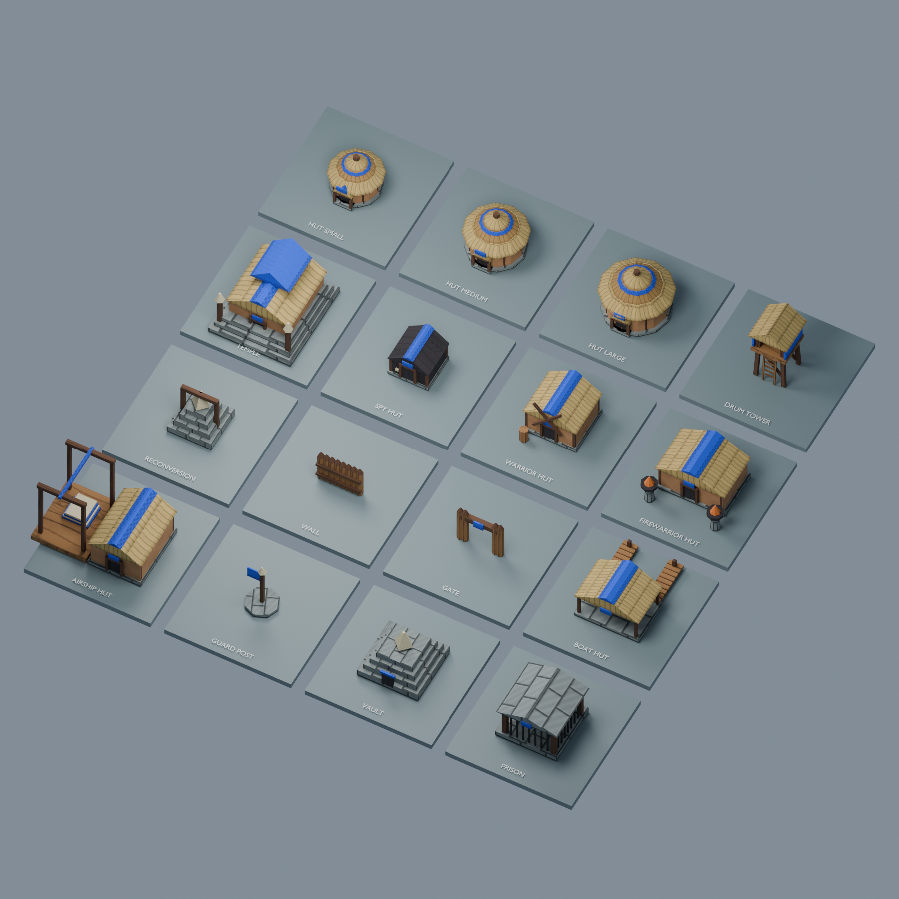

# Generated building kit

16 low-poly models with procedural surface textures, made by an AI-written script (gpt-astra) for
Open Populous; no original game art or external inputs. Licence below.
See [credits](../../CREDITS.md) and the [asset inventory](../../../docs/specs/assets.md).



```sh
python3 tools/generate_buildings.py          # regenerate atlas + all GLBs, from repository root
python3 tools/generate_buildings.py --check  # verify atlas and GLB reproducibility, no writes (in just test)
blender --background --factory-startup --python tools/preview_buildings.py -- \
  building-kit.png --blend building-kit.blend
```

The Python generator is the source of truth. No Blender install is required to build/run the game.
Import any `.glb` into Blender using **File > Import > glTF 2.0**. It contains two scenes:
**Built** (`Body`) and **Construction** (`Scaffold`); hide the scaffold while editing the finished
model. The review script hides scaffolds and adds labelled plinths and a camera. Its `.blend`
is an optional review/editing file, not an extra runtime dependency.

## Runtime contract

- One unit = one map cell, right-handed Y-up, ground Y=0. Entry faces -Z; boat piers extend +Z.
  Blender converts glTF to its Z-up convention automatically.
- Both named meshes have baked positions, flat normals, triangle primitives, `TEXCOORD_0` UVs and no
  node transforms, skins, animations or extensions. Positions/UVs/material factors are read synchronously from
  embedded bytes by `generated_buildings.rs`; the client does not load the glTF scenes as entities.
- `Tribe` material is replaced by the owner's colour (blue/red/yellow/green, neutral grey).
  Other base-colour factors are linear RGB and remain unchanged. The client preserves them as vertex
  colours, multiplied by the grayscale surface atlas, including on partial construction meshes.
  Roughness is 0.9, no metal.
- All geometric details share one body mesh; construction uses the existing bottom-up triangle bands.
  `Scaffold` is a separately authored timber frame. No per-frame mesh load is needed.
- Huts have a central smoke vent at the highest point, compatible with the existing smoke emitter.
- Body fits the simulation footprint (small allowance for eaves/posts); the boat jetty extends into
  its launch channel. These visual assets do not change placement, walking or construction rules.
- Editing in Blender is supported for art work, but arbitrary Blender re-exports are not a runtime
  scene format: apply transforms, keep the mesh/material names/contract, and run the asset tests.
  To keep `--check` passing, port final edits back to the generator or intentionally revise the pipeline.

## Surface textures

`tools/building_textures.py` generates `surfaces.png`, a 512 x 512 opaque sRGB atlas of neutral
surface detail: plaster grain/cracks, timber grain/knots, planks, overlapping straw courses,
staggered stone blocks, dark wood, woven tribe cloth, linen and ember mottling. These are newly
authored patterns, not processed photographs or original-game textures. Pigments stay in the
material factors, so tribe colour remains independent of cloth detail.

Each 128-pixel tile has an 8-pixel extruded gutter. Face-projected UVs stay inside their material's
tile, with grain aligned along beams and roof slopes. Density is isotropic (one swatch per 1.5 cells;
larger faces fit one swatch). Every GLB links `surfaces.png` by relative URI, so Blender finds it
next to the model and the game binary carries one copy. The client uploads that single shared PNG, with five linear-light mip
levels (512 down to 32), trilinear filtering and max LOD 4. Construction preserves both UVs and
pigments; scaffolds use the same timber texture. No new shaders or runtime image dependencies.

The Blender preview uses Cycles CPU rendering to show the actual texture/material combination.

| File | Distinguishing shape |
|---|---|
| `hut_small/medium/large.glb` | Increasing round clay homes, layered thatch, porch, tribe belt, smoke vent |
| `drum_tower.glb` | Braced stilts, ladder, raised drum platform and canopy |
| `temple.glb` | Broad steps, tiered canopy, paired ceremonial posts |
| `spy_hut.glb` | Compact dark lodge |
| `warrior_hut.glb` | Crossed training poles and practice post |
| `firewarrior_hut.glb` | Wide hall, paired braziers (static ember cones; the client adds an animated flame on them) |
| `boat_hut.glb` | Open shed, two rear piers and an open launch channel |
| `airship_hut.glb` | Workshop, tall assembly gantry, folded cloth |
| `vault.glb` | Stepped stone archive with pale capstone |
| `prison.glb` | Open-bar cage beneath a stone roof |
| `reconversion.glb` | Small stepped shrine and timber arch (project interpretation) |
| `wall/gate.glb` | Timber palisade / open lintelled passage |
| `guard_post.glb` | Banner pole on an octagonal base |

Unknown model IDs intentionally retain the labelled diagnostic box. This kit supplies visuals;
production, repairs, destruction and progressive construction still need simulation work.

## Licence

To the extent possible under law, the contributors to this generated kit waive all copyright and
related or neighbouring rights in the `.glb` and `surfaces.png` artwork under
[CC0 1.0 Universal](https://creativecommons.org/publicdomain/zero/1.0/).
The generator and client code remain under the repository's MIT licence.
